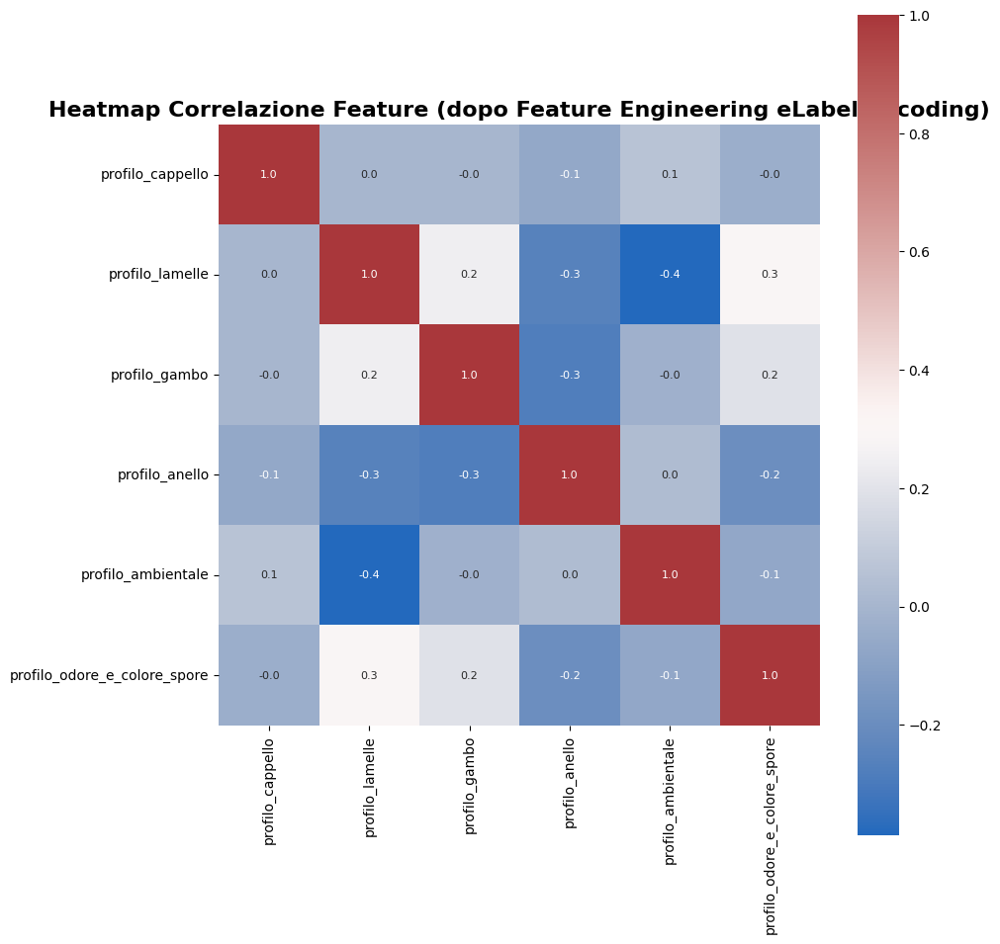

# 🍄 Mushroom Classification API

## Accesso Rapido

* **Interactive API Docs:** [http://localhost:8000/docs](http://localhost:8000/docs)  
* **Web User Interface:** [http://localhost:8000/](http://localhost:8000/)

(+ interfaccia web minimale per input manuale)

---

## Dataset & Feature Engineering

Il progetto utilizza il **UCI Mushroom Dataset** (8124 campioni, 22 feature categoriche originali).

### Feature Engineering Applicate

Per ridurre la dimensionalità e migliorare le prestazioni, le feature originali sono state combinate in **6 profili compositi**:

| Profilo | Feature Combinate | Motivazione |
|---------|------------------|-------------|
| **profilo_cappello** | cap-shape + cap-surface + cap-color | Il cappello è il principale indicatore visivo della specie |
| **profilo_lamelle** | gill-attachment + gill-spacing + gill-size + gill-color | Le lamelle sono fortemente correlate alla tossicità |
| **profilo_gambo** | stalk-shape + stalk-root + stalk-surface (above/below) + stalk-color (above/below) | Struttura del gambo distintiva per specie |
| **profilo_anello** | ring-number + ring-type | Presenza e tipo di anello discriminante |
| **profilo_ambientale** | population + habitat | Habitat naturale indicativo della specie |
| **profilo_odore_e_colore_spore** | odor + spore-print-color | **Quasi perfetta separazione** tra classi |

**Risultato:** Da 22 feature categoriche originali → **6 feature composite encodate**

### Target Variable
- **0 = Commestibile (Edible)** 🍄
- **1 = Velenoso (Poisonous)** ☠️

---
## 🔬 Analisi Esplorativa

### Distribuzione Target

```
Commestibili (0): 4208 campioni (51.8%)
Velenosi (1):     3916 campioni (48.2%)
```

**Dataset bilanciato** → Non richiede tecniche di resampling (SMOTE, undersampling, etc.)

---

## Modelli Implementati

L'API permette di confrontare tre approcci di classificazione:

### 1. XGBoost (Extreme Gradient Boosting)

Algoritmo di ensemble learning basato su decision trees e gradient boosting.

* **Principio:** Costruisce sequenzialmente alberi decisionali dove ogni nuovo albero corregge gli errori dei precedenti.

* **Funzione Obiettivo:**

    $$\mathcal{L}(\phi)=\sum_{i} l(\hat{y}_i, y_i)+\sum_{k}\Omega(f_k)$$

    Dove:
    - $l$ = loss function (log loss per classificazione binaria)
    - $\Omega(f_k)$ = termine di regolarizzazione (penalizza la complessità dell'albero)

* **Gradient Boosting:** Ogni albero $f_t$ minimizza il gradiente della loss:

    $$\hat{y}_i^{(t)}=\hat{y}_i^{(t-1)}+\eta \cdot f_t(x_i)$$

    Dove $\eta$ è il learning rate (0.1 nel modello).

**Configurazione:**
- `n_estimators=200` (numero di alberi)
- `max_depth=5` (profondità massima albero)
- `learning_rate=0.1`

---

### 2. Logistic Regression

Modello lineare per classificazione binaria con funzione sigmoide.

* **Logica Matematica:**

    $$P(y=1|x)=\sigma(w^T x+b)=\frac{1}{1+e^{-(w^T x+b)}}$$

    Dove:
    - $w$ = vettore dei pesi
    - $b$ = bias
    - $\sigma$ = funzione sigmoide

* **Decision Boundary:**

    $$\text{Classe} = \begin{cases} 1 \text{ (velenoso)} & \text{se } P(y=1|x) \geq 0.5 \\ 0 \text{ (commestibile)} & \text{se } P(y=1|x) < 0.5 \end{cases}$$

**Pre-processing:**
- Richiede **StandardScaler** per normalizzare le feature encodate


---

### 3. Neural Network (Deep Learning)

Rete neurale feed-forward con architettura a 4 layer.

* **Architettura:**

```
Input Layer (6 features)
    ↓
Dense(128, ReLU) + BatchNorm + Dropout(0.3)
    ↓
Dense(64, ReLU) + BatchNorm + Dropout(0.2)
    ↓
Dense(32, ReLU) + Dropout(0.1)
    ↓
Output(1, Sigmoid) → Probabilità [0,1]
```

* **Funzioni di Attivazione:**

    - **ReLU (Hidden Layers):** $f(x) = \max(0, x)$
    - **Sigmoid (Output):** $\sigma(x) = \frac{1}{1+e^{-x}}$

* **Loss Function:** Binary Crossentropy

    $$\mathcal{L} = -\frac{1}{N}\sum_{i=1}^{N}[y_i \log(\hat{y}_i)+(1-y_i)\log(1-\hat{y}_i)]$$

**Tecniche di Regolarizzazione:**
- **Batch Normalization:** Normalizza attivazioni tra layer per stabilità
- **Dropout:** Disattiva casualmente neuroni durante training (previene overfitting)
- **Early Stopping:** Monitora validation loss e ferma il training (patience=15)

---

##  Correlazioni tra Feature



**Risultato della Heatmap:**
- `profilo_odore_e_colore_spore` mostra correlazione negativa con `profilo_lamelle` (-0.4)
- `profilo_cappello` e `profilo_lamelle` sono relativamente indipendenti (0.0)
- Feature engineering efficace: bassa multicollinearità tra profili

---

## Endpoints

### Predizione via XGBoost
`POST /predict/xgboost`

### Predizione via Logistic Regression
`POST /predict/logistic`

### Predizione via Neural Network
`POST /predict/neural_network`

**Corpo della Richiesta (JSON):**
```json
{
  "profilo_cappello": 79,
  "profilo_lamelle": 7,
  "profilo_gambo": 27,
  "profilo_anello": 4,
  "profilo_ambientale": 4,
  "profilo_odore_e_colore_spore": 1
}
```

**Esempio di Risposta:**
```json
{
  "model": "xgboost",
  "prediction": 0
}
```

**Interpretazione:**
- `prediction: 0` → **COMMESTIBILE 🍄**
- `prediction: 1` → **VELENOSO ☠️**

---

##  Performance dei Modelli

Risultati su test set (20% del dataset):

| Modello | Accuracy | Precision | Recall | F1-Score |
|---------|----------|-----------|--------|----------|
| **XGBoost** | ~1.000 | ~1.000 | ~1.000 | ~1.000 |
| **Logistic Regression** | ~0.986 | ~0.986 | ~0.986 | ~0.986 |
| **Neural Network** | ~0.998 | ~0.998 | ~0.998 | ~0.998 |

**Note:**
- XGBoost raggiunge performance quasi perfette grazie alla natura categorica del problema
- Neural Network mostra ottime generalizzazioni con early stopping
- Logistic Regression competitivo nonostante sia un modello lineare (grazie al feature engineering)

---

## Setup

### Prerequisiti
- Python 3.8+
- Docker 


### Distribuzione con Docker
```bash
# Build dell'immagine
docker build -t mushroom-api .

# Run del container
docker run -p 8070:8000 mushroom-api
```

---

##  Struttura del Progetto

```text
/app
├── app.py                              # Logica FastAPI e routing
├── index.html                          # Interfaccia UI minimale
├── mushroom-data.py                    # Data analysis, feature engineering, training
├── xgboost_model.pkl                   # Modello XGBoost
├── logistic_regression_model.pkl       # Modello Logistic Regression
├── neural_network_model.keras          # Modello Neural Network (Keras/TensorFlow)
├── scaler.pkl                          # StandardScaler per Logistic Regression
├── requirements.txt                    # Dipendenze del progetto
├── Dockerfile                          # Containerizzazione
├── mushroom_correlation_heatmap.png    # Heatmap originale (pre feature engineering)
└── mushroom_correlation_heatmap_2.png  # Heatmap post feature engineering
```

---

##  Test del Sistema

### Test via cURL

```bash
# Test XGBoost
curl -X POST "http://localhost:8000/predict/xgboost" \
  -H "Content-Type: application/json" \
  -d '{
    "profilo_cappello": 79,
    "profilo_lamelle": 7,
    "profilo_gambo": 27,
    "profilo_anello": 4,
    "profilo_ambientale": 4,
    "profilo_odore_e_colore_spore": 1
  }'
```


